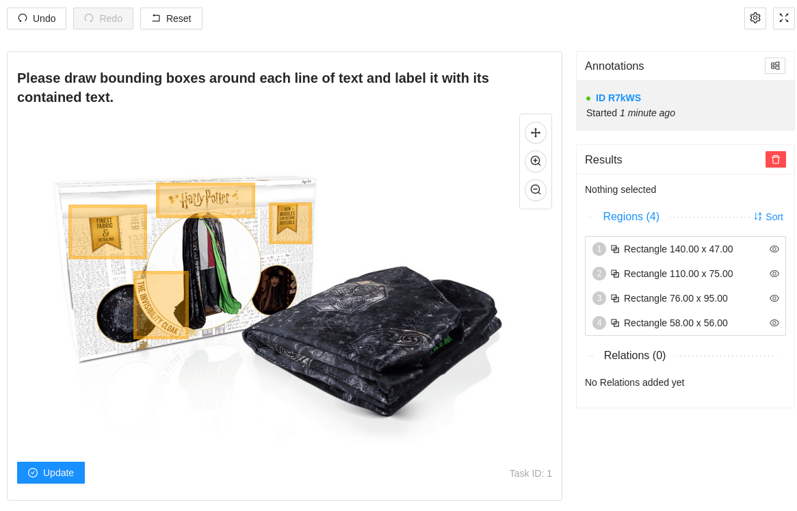

# Label Studio OCR

This is a template for the Label Studio OCR application.
That means users can draw bounding boxes around text in an image.
This will help you to create a dataset for OCR models.

## Image

## Parameters

| Parameter | Description | Default |
| --------- | ----------- | ------- |
| `annotations` | Annotations to load | `[]` |
| `id` | ID of the element to attach the Label Studio application to | `1` |
| `image` | URL of the image to annotate | `https://upload.wikimedia.org/wikipedia/commons/thumb/1/1b/US_1.svg/1200px-US_1.svg.png` |

## HTML

The HTML template is located at [index.html](./index.html).

## JSON Schema

The JSON schema is located at [schema.json](./schema.json).

### Example

An example JSON schema is located at [example.json](./example.json).

## Sources

- <https://github.com/HumanSignal/label-studio-frontend>
